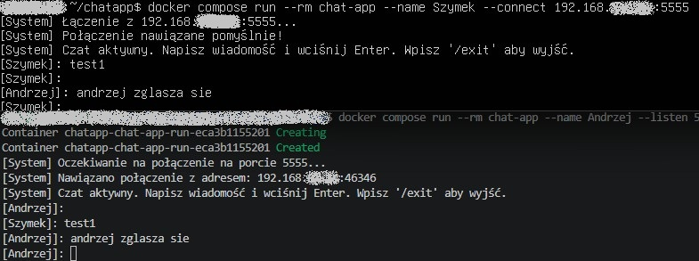

## Wymagania
-   Docker
-   Docker Compose

## Instalacja

1.  **Sklonuj repozytorium:**
    sklonuj kod źródłowy na swój komputer.
    ```bash
    git clone https://github.com/aufy1/chatapp.git
    cd chatapp
    ```

2.  **Zainstaluj Docker i Docker Compose:**
    użyj:
    ```bash
    sudo apt update
    sudo apt install docker.io docker-compose-v2 -y
    ```
    użyj aby uruchamiać kontener użytkownikiem a nie rootem:
    ```bash
    sudo usermod -aG docker $USER
    ```
    **Ważne:** Po wykonaniu tej komendy musisz się wylogować i zalogować ponownie, aby zmiany weszły w życie.


### Uruchomienie

Najpierw zbuduj obraz Docker za pomocą Docker Compose:
```bash
docker-compose build
```

**Osoba 1 (Host):**
Aby uruchomić czat jako host nasłuchujący na porcie `5555`:
```bash
docker-compose run --rm chat-app --name Szymek --listen 5555
```

**Osoba 2 (Gość):**
Aby uruchomić czat jako gość łączący się z hostem o adresie `adres Osoby 1:5555`:
```bash
docker-compose run --rm chat-app --name Andrzej --connect adresos1:5555
```

Flaga `--rm` powoduje automatyczne usunięcie kontenera po zakończeniu czatu.

## Ograniczenia

* Maszyna hosta musi mieć odblokowany wybrany port dla przychodzącego TCP w zaporze sieciowej
* Limit 2 użytkowników
* Ruch nie jest szyfrowany